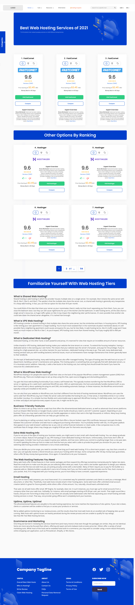

Link to the FIGMA DESGIN
===============
[Hosting Website Figma Design Link](https://www.figma.com/file/93czad7CXu3cO4wb7azUuu/HOSTING-COMPANY-COMPARE-WEBSITE-(Community)?node-id=1%3A2").

## Instructions For Collaborators
* Clone this repository to get started.
* It is advice for each one of the collaborators to to create a branch and try not to push to main and before any of the stater files can be edited is adviced you bring it to our notice.
* And once you push to your branch always pull a request so i can check it if i'm to merge it.
* Let try to follow the convention of this project like good variable name for our root files.

# Preview of the main site
